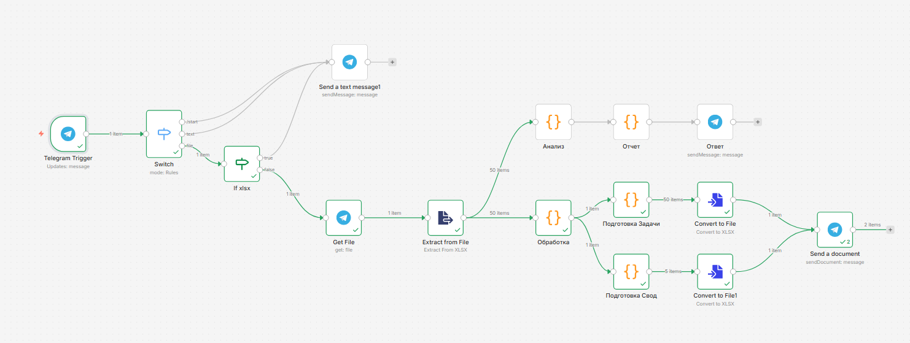
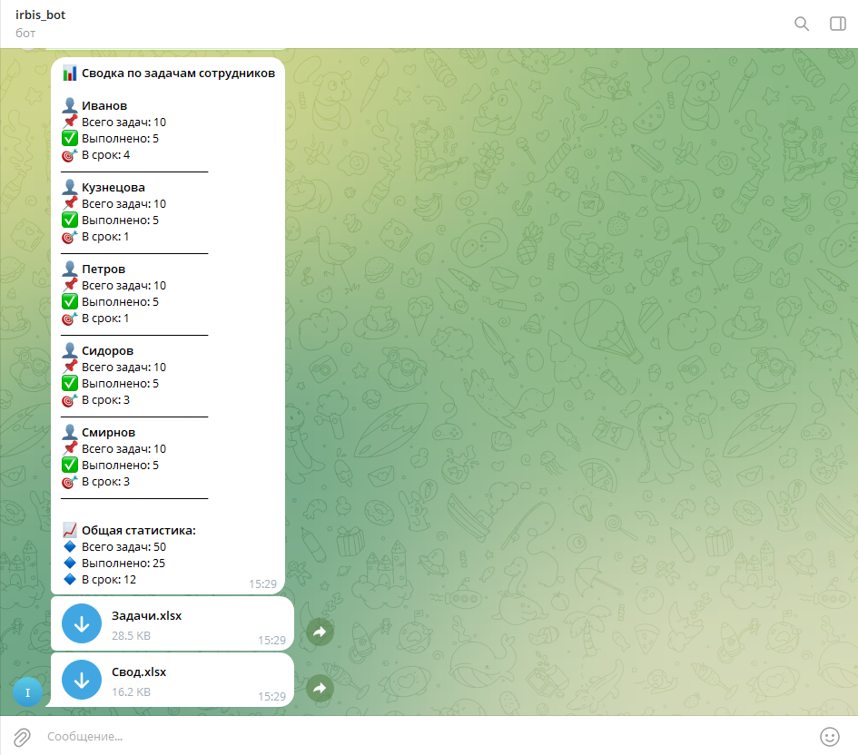

# Telegram Excel Bot for Task Statistics

Бот для Telegram, который принимает Excel-файл с задачами сотрудников, анализирует данные и возвращает:
- Текстовый отчёт со статистикой по сотрудникам
- Обогащённый Excel-файл с листами «Задачи» (добавлена колонка «Выполнено в срок») и «Свод» (агрегированные данные)

## 🚀 Как запустить

### 1. Требования
- [n8n](https://n8n.io/) (self-hosted)
- Telegram Bot Token (получить у @BotFather)

## 🤖 Использование бота

Напишите боту [@irbsac19076_bot](https://t.me/irbsac19076_bot)) в Telegram команду /start
Отправьте боту файл в формате .xlsx с листом «Задачи»
Бот проанализирует данные и пришлёт:
1. Текстовый отчёт со статистикой по сотрудникам
2. Excel-файлы:
- Задачи — исходные данные + колонка «Выполнено в срок»
- Свод — агрегированные данные по сотрудникам

## 🧠 Использование ИИ

В процессе разработки я использовал ИИ (ассистента) для:

- Генерации кода обработки данных — ИИ помог написать функции для преобразования «грязных» данных (числа прописью, пробелы, пустые значения) в корректные числовые форматы.
- Отладки и оптимизации — когда возникали ошибки (например, неправильная структура данных для Convert to File), ИИ предлагал варианты исправления и объяснял причины.

✍️ Что дорабатывалось самостоятельно

- Проектирование структуры n8n workflow — ИИ подсказал оптимальную последовательность нод и способы передачи данных между ними.
- Тестирование на реальных данных — проверка работы с разными форматами (числа текстом, пустые ячейки, пробелы).
- Настройка Telegram-бота — регистрация бота у @BotFather.
- Финальная сборка и документирование — оформление README, экспорт workflow.

  ## Скриншоты работы бота
  
*Сценарий в n8n*

*Бот отвечает на команду /start*

*Текстовый отчёт и полученные файлы*
